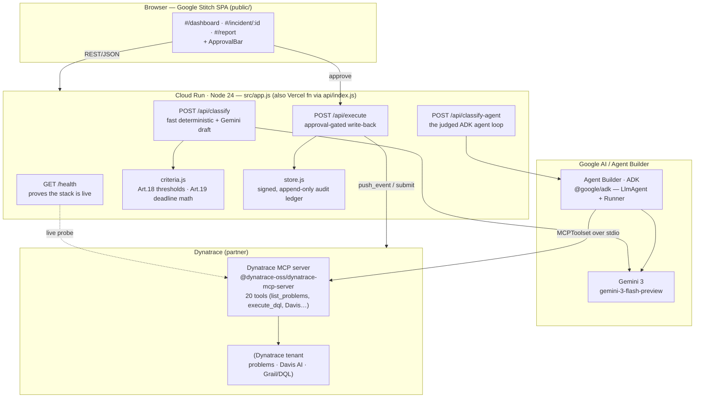
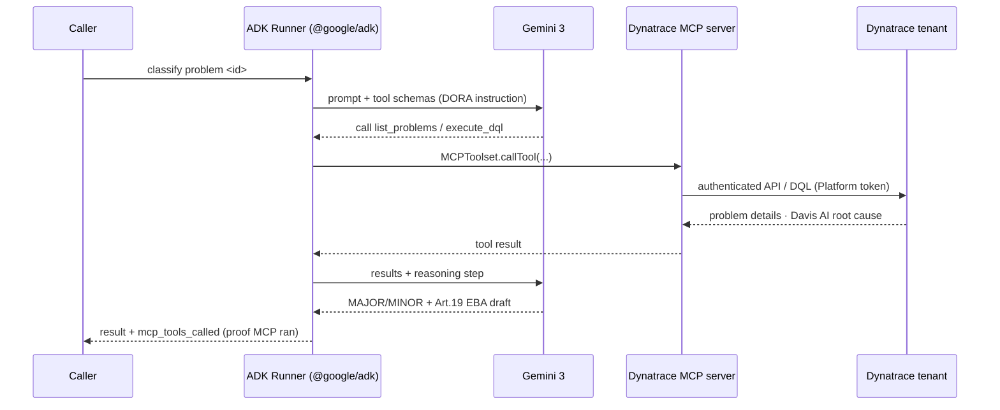

# DynaCompliance — Architecture

DynaCompliance turns a Dynatrace ICT incident into a DORA-compliant, human-approved
regulatory filing. It runs as a single Node 24 service on Cloud Run, with **all three
required technologies executing at runtime**: Gemini 3, Google Cloud Agent Builder (ADK),
and the Dynatrace MCP server.

## System overview



## The judged agent loop (`POST /api/classify-agent`, `src/adk-agent.js`)

One genuine agent invocation where **ADK orchestrates Gemini 3 over live Dynatrace MCP tools**.



## Two execution paths (and why)

| Path | Tech exercised | Purpose |
|---|---|---|
| `POST /api/classify` | Deterministic `criteria.js` + **Gemini 3** draft (`GEMINI_LIVE`) | Fast, predictable UI response; the verdict is auditable, the LLM only explains |
| `POST /api/classify-agent` | **ADK** + **Gemini 3** + **Dynatrace MCP** in one loop | The judged agent — proves all three required techs run at runtime |

The deterministic classifier ([`criteria.js`](src/criteria.js)) is the regulatory core: DORA
Art.18 thresholds are evaluated in code so a verdict is **defensible and reproducible**, and
Gemini is confined to explanation + drafting (no hallucinated thresholds). Art.19 deadlines
(4h / 72h / 1 month) anchor on the **detection** timestamp.

## Responsible-AI control plane

Every consequential action is gated:

- `POST /api/execute` returns **403** without explicit approval, **400** without an identified
  approver (DORA accountability).
- Approved actions write a **signed, append-only audit record** ([`store.js`](src/store.js)) —
  who approved what, when — surfaced in the monthly report's Audit Trail.
- The Agent Builder definition ([`agent-builder/agent.json`](agent-builder/agent.json)) marks
  writes as `requireApprovalFor`, mirroring the UI ApprovalBar.

## Runtime / deployment notes (hard-won)

- **Node 24 required** — `@dynatrace-oss/dynatrace-mcp-server` bundles an `undici` that calls
  `webidl.util.markAsUncloneable` (added in Node 22). `node:20` crashes on MCP startup.
- **Cloud Run read-only FS** — the MCP server is spawned with `HOME=/tmp` and
  `DT_MCP_DISABLE_TELEMETRY=true` so it doesn't try to write to a read-only `$HOME`.
- **Two Dynatrace auth models** — the MCP path uses a **Platform token** (`dt0s16…`) against
  the `…apps.dynatrace.com` URL; the REST fallback uses a classic API token (`dt0c01…`).
- **Single source, two targets** — `src/app.js` is exported without `listen()`, so it runs both
  as a Cloud Run server (`src/server.js`) and a Vercel function (`api/index.js`).

## Repository map

```
src/
  app.js            Express app (all routes; no listen) — Cloud Run + Vercel
  server.js         Cloud Run entrypoint
  adk-agent.js      JUDGED agent: @google/adk + Gemini 3 + Dynatrace MCP (one loop)
  dynatrace-mcp.js  runtime MCP client (DT_USE_MCP) — spawn → listTools → callTool
  dynatrace.js      REST v2 fallback + write-back (push_event)
  agent.js          fast deterministic path + GEMINI_LIVE hybrid draft
  criteria.js       DORA Art.18 thresholds + Art.19 deadline math (deterministic)
  store.js          signed append-only audit ledger (Neon Postgres or in-memory)
  mockdata.js       badged demo incidents for a vivid walkthrough
agent-builder/agent.json   Agent Builder declarative form of the same agent
public/             Google Stitch SPA (dashboard / deep-dive / report)
```
