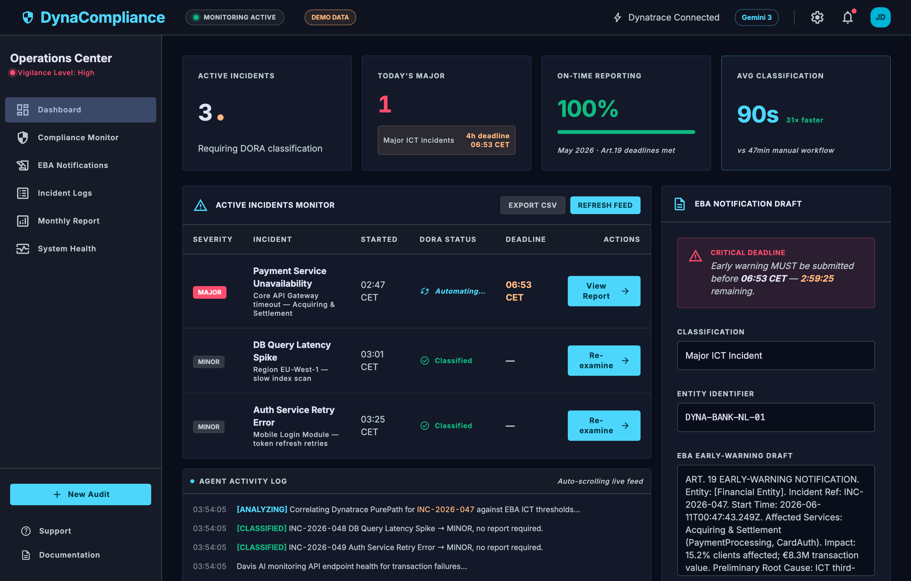
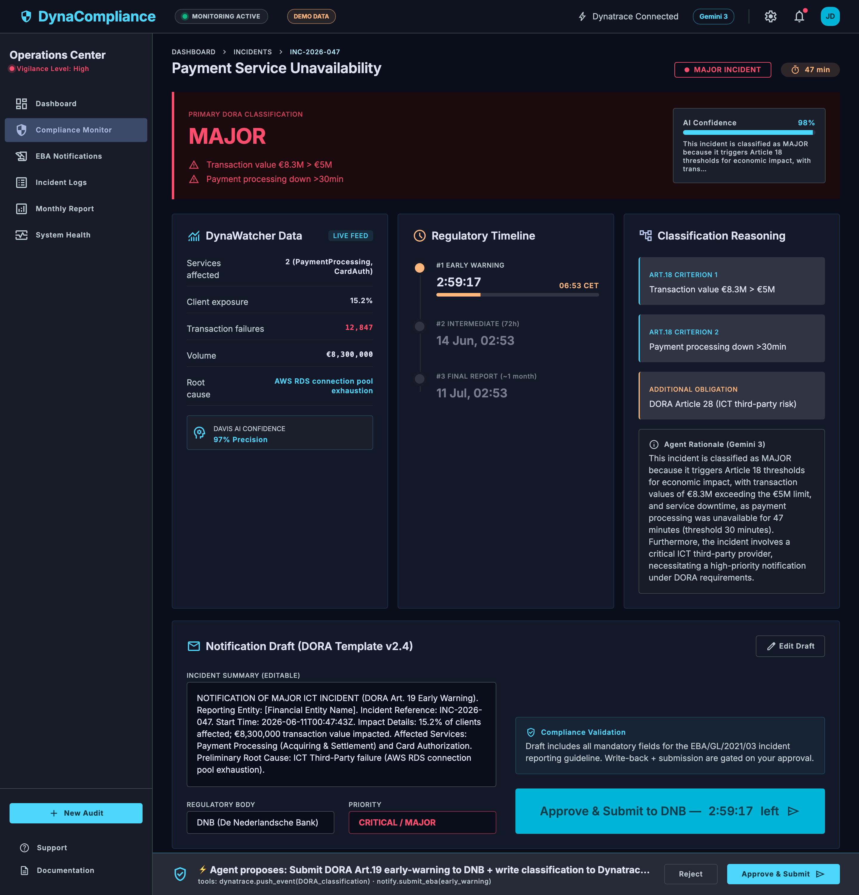
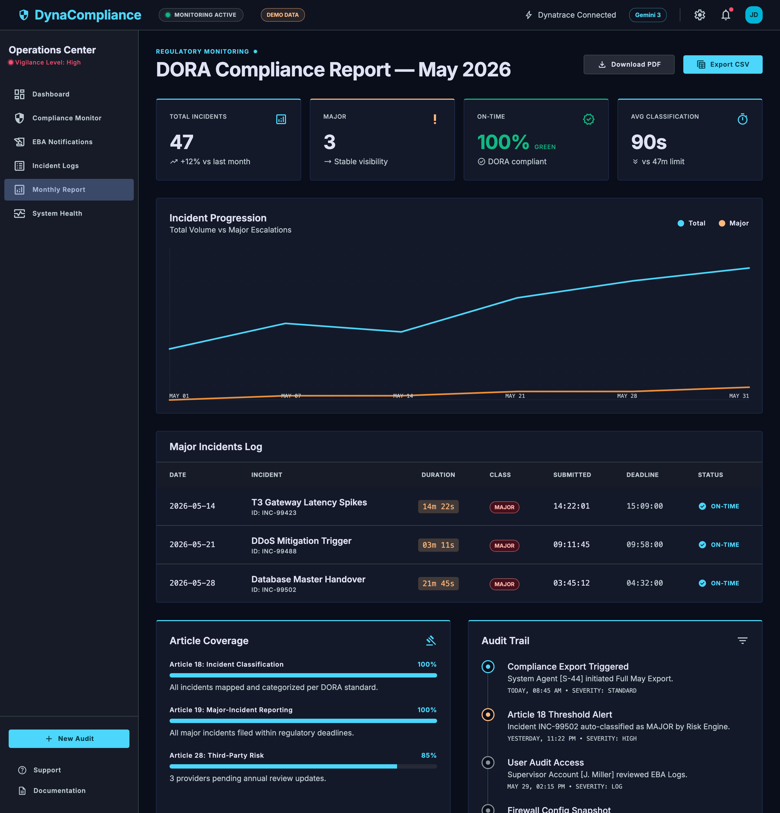
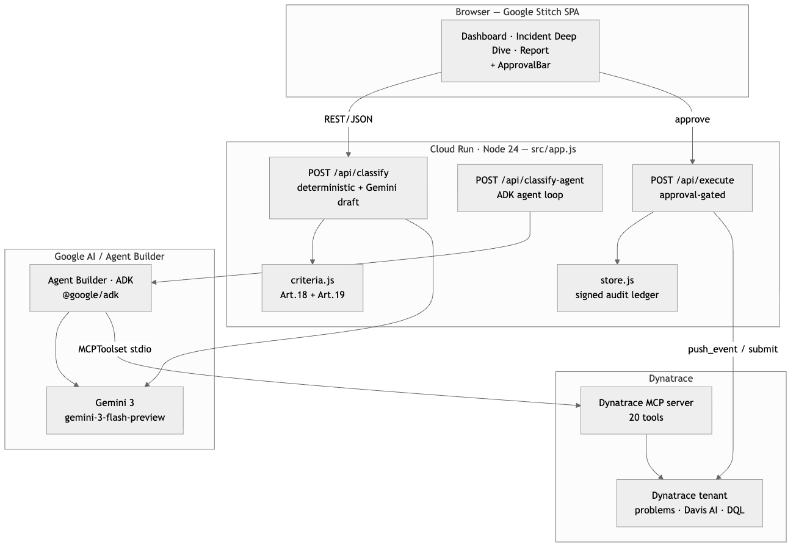

# DynaCompliance — DORA Art.18/19 Incident Classification & Reporting Agent

[](LICENSE)
[](https://dynacompliance-908307939543.europe-west1.run.app)
[](https://ai.google.dev/)
[-34A853?logo=google&logoColor=white)](https://github.com/google/adk-js)
[](https://github.com/dynatrace-oss/dynatrace-mcp)
[](https://nodejs.org/)

> ### ▶ Live demo: **https://dynacompliance-908307939543.europe-west1.run.app**
> Proof the required stack runs at runtime: [`/health`](https://dynacompliance-908307939543.europe-west1.run.app/health) →
> `gemini_live`, `partner_mcp_connected` (20 Dynatrace tools), `agent_builder`.

Dynatrace detects an ICT incident → the agent collects the data, applies DORA
**Article 18** major/minor classification criteria, computes the **Article 19** 4h / 72h /
1-month reporting deadlines from the **detection** timestamp, and drafts the EBA
early-warning notification — then, **with your approval**, writes the classification back
to Dynatrace and submits to the regulator. ~90 seconds vs ~47 minutes manual.

> DORA article map: **Art.17** incident-management process · **Art.18** classification
> (the major/minor thresholds) · **Art.19** reporting (early-warning / intermediate /
> final) · **Art.28** ICT third-party risk.

**Stack (Google Cloud Rapid Agent Hackathon — Dynatrace track):**
- 🧠 **Gemini 3** (`gemini-3-flash-preview`) — classification rationale + EBA drafting
- 🏗️ **Google Cloud Agent Builder / ADK** (`@google/adk`) — the agent loop at `POST /api/classify-agent`
- 📊 **Dynatrace MCP** (`@dynatrace-oss/dynatrace-mcp-server`) — live incident data, **called at runtime**
- ☁️ **Cloud Run** + **Node 24** — hosting

> **All three required technologies execute on the live URL.** The judged agent
> (`POST /api/classify-agent`, [`src/adk-agent.js`](src/adk-agent.js)) runs ADK + Gemini 3 +
> the Dynatrace MCP server in **one agent loop** and returns `mcp_tools_called` as proof the
> partner MCP server actually ran. The dashboard runs on badged demo incidents for a vivid
> walkthrough; the Gemini drafting, the MCP connection, and the ADK agent are genuinely live.

## Screenshots

| Operations Center | Incident Deep Dive | Monthly DORA Report |
|---|---|---|
|  |  |  |

**Docs:** [ARCHITECTURE.md](ARCHITECTURE.md) (system + agent-loop diagrams) ·
[DEVPOST.md](DEVPOST.md) (submission write-up) · [DECK.md](DECK.md) / [DECK.pdf](DECK.pdf) (pitch) ·
[DEMO.md](DEMO.md) (3-min demo script) · [DEMO_VIDEO_PLAN.md](DEMO_VIDEO_PLAN.md) (video storyboard)



## Architecture
```
Browser (public/index.html) ──POST /api/classify──► agent (src/agent.js)
                                                      1. collect problem  → Dynatrace MCP
                                                      2. classify         → criteria.js (Art.18 thresholds)
                                                      3. explain + draft  → Gemini 3 (rationale + EBA notice)
                                                      4. deadlines        → from incident start
                                                      5. PROPOSE submit ─┐ (gated)
ApprovalBar (human approves) ──POST /api/execute──►  push_event + submit EBA notification
```
**All three required technologies in one genuine agent loop** — `POST /api/classify-agent`
([`src/adk-agent.js`](src/adk-agent.js)) runs the agent on **Google Cloud Agent Builder's
ADK** (`@google/adk`: `LlmAgent` + `Runner`), reasoning with **Gemini 3**, over the live
**Dynatrace MCP** server (`@dynatrace-oss/dynatrace-mcp-server`) exposed as an `MCPToolset`.
The response includes `mcp_tools_called` — proof the partner MCP server actually executed.
This is the judged path; [`agent-builder/agent.json`](agent-builder/agent.json) is the same
agent in Agent Builder's declarative form.

The fast Express UI path mirrors it deterministically, and with `DT_USE_MCP=true` it too
invokes the real MCP server at runtime ([`src/dynatrace-mcp.js`](src/dynatrace-mcp.js):
spawn → handshake → `listTools` → `callTool`). Confirm wiring at `/health` →
`agent_builder`, `partner_read_path`, and a live MCP status probe.

## Two agents
- **DynaWatcher** — collects problem details, affected entities, metrics, Davis AI root cause.
- **DORAClassifier** — applies Art.18 thresholds, flags Art.28 (third-party), drafts the Art.19 EBA notice, proposes the write/submit.

## Quick start (local)
```bash
cp .env.example .env     # GCP project + DT_ENV_URL + DT_API_TOKEN
npm install
gcloud auth application-default login && gcloud config set project "$GOOGLE_CLOUD_PROJECT"
npm run dev              # http://localhost:8080 → paste a Dynatrace problem ID
```

### Demo mode (no credentials) — the full Operations Center UI
Run the whole app end-to-end with canned, classifier-driven data. Port `8080` is
often taken by the sibling IncidentIQ app, so pick a free port:
```bash
MOCK=true PORT=8090 npm start     # http://localhost:8090
```
The front-end is a single live SPA implementing the three Google Stitch screens:
- **`#/dashboard`** — Operations Center: hero KPIs, Active Incidents Monitor (live
  from `/api/incidents`), Agent Activity Log, and the EBA Notification Draft with a
  live 4h countdown.
- **`#/incident/:id`** — Incident Deep Dive: DORA verdict + AI confidence, DynaWatcher
  data, regulatory timeline (live early-warning countdown + progress bar),
  classification reasoning, and the editable EBA draft gated by the **ApprovalBar**
  (`/api/execute` runs only after you approve).
- **`#/report`** — Monthly DORA compliance report from `/api/report`: KPI bento,
  incident-progression trend, Major Incidents Log, Article Coverage, Audit Trail.

**API surface:** `GET /health` · `GET /api/incidents` · `GET /api/problems` ·
`POST /api/classify` (fast deterministic path) · **`POST /api/classify-agent`** (the real
ADK agent: Gemini 3 + Dynatrace MCP, returns `mcp_tools_called`) · `POST /api/execute`
(approval-gated, requires approver, writes signed audit) · `GET /api/audit` ·
`GET /api/report` · `POST /api/handoff`.

Run the deterministic-core tests: `npm test`.

> ⚠️ Map your real metrics: `src/dynatrace.js → toIncident()` currently reads
> `clients_affected_pct`, `transaction_value_eur`, etc. as placeholders. Wire these to
> your monitored metrics / Davis fields so the Art.18 thresholds evaluate correctly.

## Deploy

The app runs as a long-lived server (`src/server.js`, for Cloud Run) **and** as a Vercel
serverless function (`api/index.js`) — both import the same `src/app.js`. The approval
audit ledger persists to Neon Postgres when `DATABASE_URL` is set (in-memory fallback
otherwise).

### Environment variables (both targets)
| Var | Purpose |
|---|---|
| `GEMINI_API_KEY` | Gemini Developer API (simplest; used on Vercel). Omit to use Vertex AI. |
| `GEMINI_MODEL` | Model id (verify availability to your key/project). |
| `DT_ENV_URL`, `DT_API_TOKEN` | Dynatrace API v2 (REST read path + approval-gated write-back; least-privilege token: read problems/entities/metrics, ingest events). |
| `DT_USE_MCP` | `true` → reads go through the **real Dynatrace MCP server** (`@dynatrace-oss/dynatrace-mcp-server`), spawned and called at runtime by `src/dynatrace-mcp.js`. Default `false` (REST). |
| `DT_ENVIRONMENT`, `DT_PLATFORM_TOKEN` | Required when `DT_USE_MCP=true` — the MCP server's auth contract (Platform URL `…apps.dynatrace.com`, **not** classic `.live.`, + a Platform token). |
| `DATABASE_URL` | Neon Postgres connection string for the audit ledger. |
| `INCIDENTIQ_URL` | (optional) sibling app for the cross-app handoff. |
| `MOCK` | `true` for credential-free demo; unset/`false` for live. |

### A. Vercel
```bash
vercel link                       # link/create the project (no GitHub required)
# set secrets (Preview + Production):
vercel env add GEMINI_API_KEY production
vercel env add DT_ENV_URL production
vercel env add DT_API_TOKEN production
vercel env add DATABASE_URL production      # Neon (Vercel → Storage → Neon provisions this)
vercel deploy                     # preview URL → verify /health → then:
vercel deploy --prod              # promote to production
```
`vercel.json` routes all paths through the Express function and bundles `public/**`.

### B. Google Cloud Run (hackathon submission URL)
```bash
gcloud run deploy dynacompliance \
  --source . \
  --region=europe-west1 \
  --allow-unauthenticated \
  --set-secrets="DT_API_TOKEN=dynacompliance-dt-token:latest,GEMINI_API_KEY=dynacompliance-gemini:latest,DATABASE_URL=dynacompliance-db:latest" \
  --set-env-vars="GEMINI_MODEL=gemini-3,DT_ENV_URL=https://your-env.live.dynatrace.com"
```
(To use Vertex AI instead of an API key on Cloud Run, drop `GEMINI_API_KEY` and add
`--set-env-vars=GOOGLE_GENAI_USE_VERTEXAI=true,GOOGLE_CLOUD_PROJECT=...` — Cloud Run's
service account provides ADC natively.)

### Connect real Dynatrace data
`src/dynatrace.js → toIncident()` currently reads placeholder metric fields. Discover the
real field names against your environment, then map them:
```bash
DT_ENV_URL=... DT_API_TOKEN=... npm run inspect:dt -- <problemId>
```
It prints the raw problem + what `toIncident()` produces, flagging which DORA fields still
need mapping to your monitored metrics / Davis AI fields.

## Health check (proof for judges)
```bash
curl https://<your-cloud-run-url>/health
# { "status":"ok", "model":"gemini-3", "partner":"dynatrace", "partner_reachable":true,
#   "partner_mcp":"agent-builder/agent.json (@dynatrace/mcp-server)", ... }
```

## License
MIT — see [LICENSE](LICENSE).
